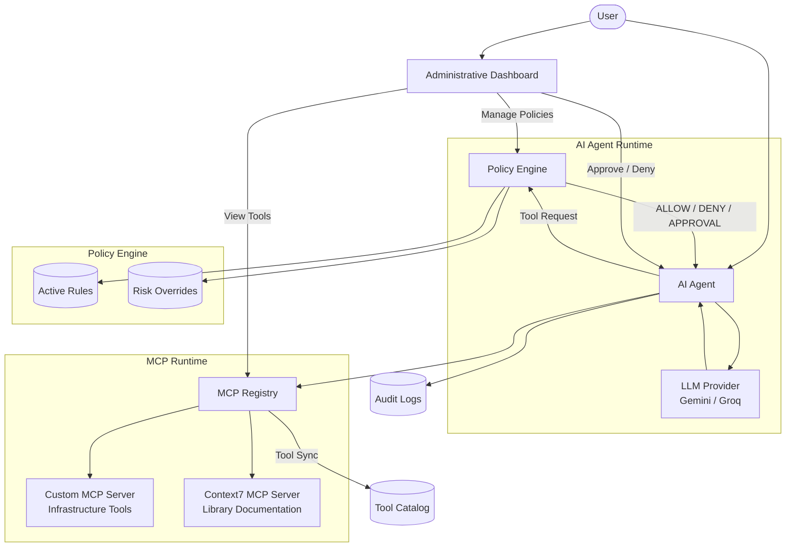
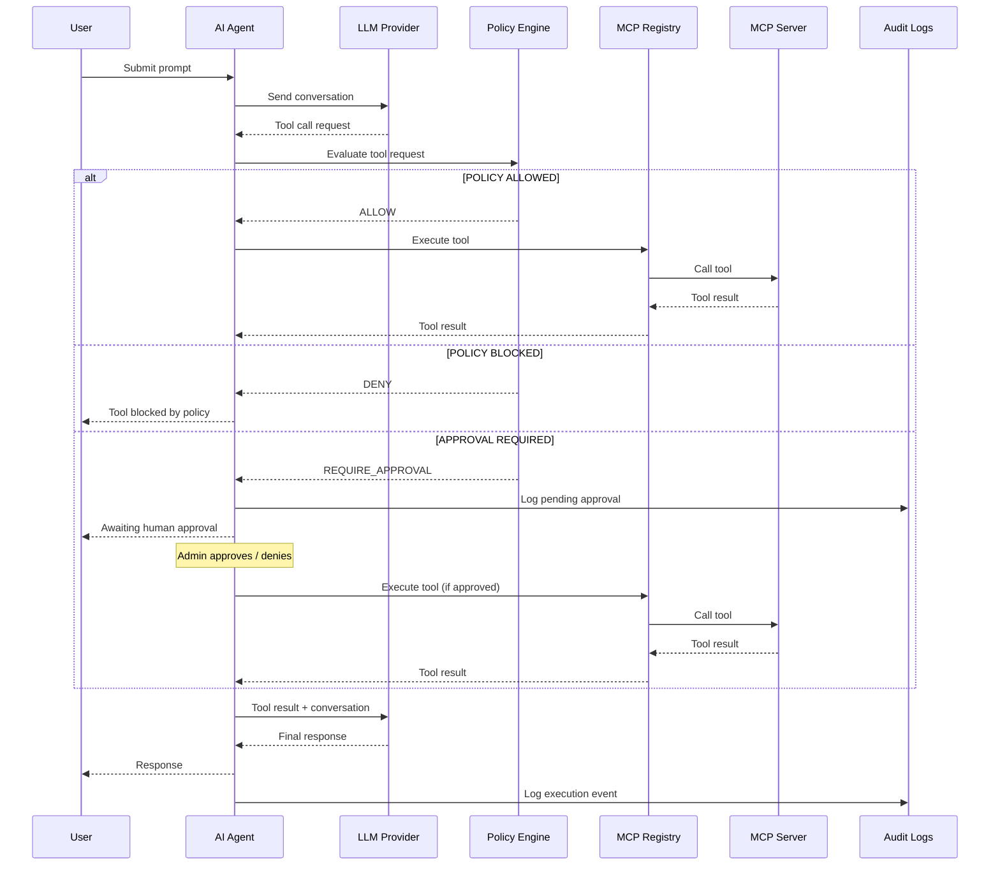
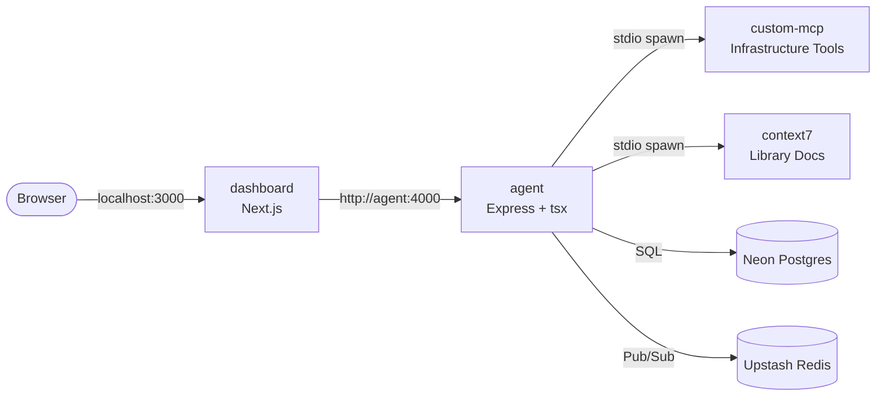

<div align="center">

# ArmorIQ

### Guarded AI Agent with Dynamic Policy Enforcement and Model Context Protocol (MCP) Support

A production-inspired AI agent runtime that sits between Large Language Models and external tools, enforcing configurable guardrails before every tool invocation.

Built as part of the ArmorIQ Software Engineer Internship Assignment.

---


</div>

---

## Overview

ArmorIQ is a secure AI agent platform built around one central idea:

> AI models should decide *what* they want to do, but independent infrastructure should decide *whether they are allowed to do it.*

Instead of allowing an LLM to directly invoke external tools, ArmorIQ inserts a dedicated Policy Engine between the model and every MCP tool execution.

Every tool request is evaluated against administrator-defined runtime policies before execution.

This architecture enables:

- Dynamic tool authorization
- Human approval workflows
- Runtime policy updates
- Prompt injection monitoring
- Centralized audit logging
- Live MCP tool discovery

The platform follows the Model Context Protocol (MCP), allowing tools to be discovered dynamically from both local and remote MCP servers without requiring application changes.

---

## Assignment Goals

This project implements all core requirements from the ArmorIQ Software Engineer assignment.

| Requirement | Status |
|-------------|:------:|
| AI Agent with Tool Loop | ✅ |
| Dynamic MCP Tool Discovery | ✅ |
| Custom MCP Server | ✅ |
| Remote MCP Server (Context7) | ✅ |
| Isolated Policy Engine | ✅ |
| Runtime Rule Updates | ✅ |
| Human Approval Flow | ✅ |
| Prompt Injection Detection | ✅ |
| Audit Logging | ✅ |
| Administrative Dashboard | ✅ |

---

## Key Features

### AI Agent

- Gemini-powered tool-using agent
- Multi-turn tool execution loop
- Dynamic MCP tool discovery
- Provider-agnostic architecture

### Policy Engine

- Runtime-configurable authorization
- Block Tool policies
- Require Approval policies
- Input Validation policies
- Token Budget enforcement
- Risk-based authorization
- Deterministic rule evaluation

### MCP Runtime

- Dynamic server registration
- Local custom MCP server
- Remote Context7 MCP integration
- Runtime tool synchronization
- Automatic Tool Catalog generation

### Administrative Dashboard

- Policy management
- Live tool catalog
- Approval queue
- Conversation logs
- Prompt injection events
- Runtime health monitoring
- Interactive AI chat playground

---

## Architecture



---

## Design Principles

The architecture is built around several core principles.

- Authorization is centralized.
- Tool discovery is dynamic.
- Runtime behavior is configuration-driven.
- Security decisions are deterministic.
- AI reasoning is separated from infrastructure authorization.
- Components communicate through well-defined boundaries.
- The platform remains extensible as additional MCP servers and policy types are introduced.

---

## Documentation

Detailed engineering documentation is available inside the `docs/` directory.

| Document | Description |
|----------|-------------|
| `00.md` | Project philosophy, problem statement, feature inventory, monorepo architecture |
| `01-backend-architecture.md` | Backend architecture, services, runtime request lifecycle |
| `02-api-reference.md` | Complete REST API reference for all endpoints |
| `03-policy-engine.md` | Policy evaluation pipeline, rule types, priority system, caching |
| `04-security-model.md` | Policy-first execution, trust boundaries, prompt injection handling |
| `05-system-design.md` | Architectural decisions, tradeoffs, runtime design, future evolution |

The README provides a high-level overview, while the documentation covers implementation details and design rationale.

## Technology Stack

ArmorIQ is built as a TypeScript monorepo with a clear separation between runtime services, shared packages and the administrative dashboard.

| Layer | Technology |
|--------|------------|
| Frontend | Next.js 16, React 19, TypeScript |
| Styling | Tailwind CSS v4, shadcn/ui, Framer Motion |
| Backend | Express 5, TypeScript |
| AI Provider | Google Gemini |
| Protocol | Model Context Protocol (MCP) |
| Local MCP | Custom Infrastructure MCP Server |
| Remote MCP | Context7 MCP Server |
| Database | PostgreSQL (Neon) |
| ORM | Prisma |
| Cache / Messaging | Redis (Upstash) |
| Runtime Sync | Redis Pub/Sub |
| Package Manager | pnpm Workspaces |
| Language | TypeScript |
| Deployment | Vercel + Render |

---

## Repository Structure

```text
.
├── apps
│   ├── agent              # AI Agent runtime
│   ├── dashboard          # Administrative dashboard
│   └── custom-mcp         # Infrastructure MCP server
│
├── packages
│   ├── db                 # Prisma client
│   ├── logger             # Shared logging utilities
│   ├── mcp-registry       # MCP discovery & execution
│   ├── policy-engine      # Runtime authorization engine
│   └── shared-types       # Shared interfaces & schemas
│
├── prisma
│
├── docs
│
└── README.md
```

The repository follows a monorepo architecture where reusable runtime components are extracted into independent workspace packages. This keeps the Policy Engine, MCP Registry and shared contracts framework-agnostic and reusable across applications.

---

## Core Components

The platform is composed of three primary applications.

### AI Agent

The backend runtime responsible for orchestrating the complete tool-use lifecycle.

Responsibilities include:

- Running the LLM tool loop
- Discovering MCP tools
- Evaluating policies
- Executing authorized tools
- Recording audit events
- Managing approval workflows

---

### Administrative Dashboard

A web interface used to configure and observe the running agent.

Capabilities include:

- Policy management
- Tool catalog
- Approval queue
- Conversation logs
- Prompt injection events
- Runtime health monitoring
- Interactive chat playground

All dashboard changes are reflected by the running agent without requiring a restart.

---

### Custom MCP Server

A standards-compliant MCP server implementing infrastructure management tools.

Example tools include:

- Restart Server
- Deploy Release
- Rollback Release
- Get Server Status
- View Infrastructure Logs

The server is discovered dynamically by the MCP Registry without requiring any hardcoded tool definitions.

---

## Runtime Overview

Every user request follows the same execution pipeline.



The Policy Engine serves as the sole authorization boundary between AI reasoning and external tool execution, ensuring that every tool invocation is evaluated consistently before reaching an MCP server.


## Getting Started

> **Want to skip local setup?** This project is fully containerized. Clone, add a `.env`, and run one command:
>
> ```bash
> git clone https://github.com/dexisback/armoriq-assignment.git
> cd armoriq-assignment
> cp .env.example .env
> # fill in your API keys
> docker compose up --build
> ```
>
> Dashboard: **http://localhost:3000** — Agent: **http://localhost:4000**
>
> See the [Docker](#docker) section below for details.

### Prerequisites

Before running the project, ensure the following tools are installed:

- Node.js 22+
- pnpm 10+
- PostgreSQL (or a Neon database)
- Redis (or Upstash Redis)
- Google Gemini API Key
- Context7 API Key

---

### Clone the Repository

```bash
git clone https://github.com/dexisback/armoriq-assignment.git

cd armoriq-assignment
```

---

### Install Dependencies

```bash
pnpm install
```

---

### Environment Variables

Create a `.env` file in the project root.

```env
DATABASE_URL=

REDIS_URL=

GEMINI_API_KEY=

CONTEXT7_API_KEY=

GROK_API_KEY=
```

> Adjust values to match your own API keys and service URLs.

---

### Build the Workspace

```bash
pnpm build
```

---

### Start the Development Servers

```bash
pnpm dev
```

This starts:

| Service | Port |
|----------|------|
| Dashboard | `3000` |
| Agent API | `4000` |

---

## Available Scripts

### Development

```bash
pnpm dev
```

Runs the dashboard and backend concurrently.

---

### Build

```bash
pnpm build
```

Builds every workspace package and application.

---

### Lint

```bash
pnpm lint
```

Runs linting across the workspace.

---

### Generate Prisma Client

```bash
pnpm prisma:generate
```

---

### Run Database Migrations

```bash
pnpm prisma:migrate
```

---

### Seed Database

```bash
pnpm seed
```

---

### Run Agent Only

```bash
pnpm dev:agent
```

---

### Run Dashboard Only

```bash
pnpm dev:dashboard
```

---

## Docker

The project ships with a production-quality Docker setup. A new contributor needs only Docker and a single `.env` file — no Node.js, pnpm, or database installation required.

### What gets containerized

| Service    | Image               | Port  | Description                          |
|------------|---------------------|-------|--------------------------------------|
| `agent`    | `Dockerfile.agent`    | 4000  | Express API + MCP registry + policy engine |
| `dashboard`| `Dockerfile.dashboard`| 3000  | Next.js admin console                 |

The **custom MCP server** is *not* a separate container — the agent launches it internally via stdio, exactly as in local development. Redis (Upstash) and PostgreSQL (Neon) remain external hosted services.

### Quick start

```bash
git clone https://github.com/dexisback/armoriq-assignment.git
cd armoriq-assignment
cp .env.example .env
# fill in DATABASE_URL, REDIS_URL, GEMINI_API_KEY, GROK_API_KEY, CONTEXT7_API_KEY
docker compose up --build
```

Once both containers are healthy:

- **Dashboard:** http://localhost:3000
- **Agent API:** http://localhost:4000

### Architecture inside Docker



### How the pieces fit together

1. **Single `docker compose up --build`** builds both images and starts both services on a shared Docker network.
2. The **agent container** installs workspace dependencies, generates the Prisma client, builds `custom-mcp`, and runs the agent via `tsx`. It keeps `custom-mcp` as an internal stdio child process — no extra container.
3. The **dashboard container** builds Next.js with `AGENT_URL=http://agent:4000` baked into the rewrite config, so all `/api/*` requests are proxied to the agent over Docker networking.
4. Both containers read secrets from a single `.env` file via `env_file:`.

### Useful commands

```bash
# start in background
docker compose up -d

# view logs
docker compose logs -f

# view only the agent logs
docker compose logs -f agent

# stop
docker compose down

# rebuild from scratch (clears images + cache)
docker compose down --rmi all && docker compose up --build
```

### Notes

- The Docker setup does **not** change application architecture. `pnpm dev` continues to work locally exactly as before.
- The Prisma client is generated at build time inside the agent image (output: `/app/generated/prisma`).
- The custom MCP server is compiled at build time and launched by the agent via `node apps/custom-mcp/dist/index.js` (relative to `/app/apps/agent`).
- `NEXT_PUBLIC_API_URL=http://agent:4000` is set in `docker-compose.yml` for client-side API calls.

---

## Verifying the Installation

After the development servers have started successfully:

- Open `http://localhost:3000`
- Navigate to the Dashboard Overview
- Confirm that the Agent reports a healthy status
- Verify that both MCP servers appear in the MCP Registry page
- Open the Tool Catalog and confirm tools have been discovered
- Open the Chat Console and submit a prompt requiring tool usage
- Check the Audit Logs to verify that execution events are being recorded

If all of the above work successfully, the platform has been configured correctly.

---

## Documentation

Detailed implementation notes are available in the `docs/` directory.

| File | Description |
|------|-------------|
| `00.md` | Project philosophy, problem statement, feature inventory, monorepo architecture |
| `01-backend-architecture.md` | Backend architecture, services, runtime request lifecycle |
| `02-api-reference.md` | Complete REST API reference for all endpoints |
| `03-policy-engine.md` | Policy evaluation pipeline, rule types, priority system, caching |
| `04-security-model.md` | Policy-first execution, trust boundaries, prompt injection handling |
| `05-system-design.md` | Architectural decisions, tradeoffs, runtime design, future evolution |

The README intentionally focuses on project usage and architecture, while the engineering handbook provides a deeper explanation of the implementation.


## Screenshots

> Screenshots will be added after deployment.

---

## Roadmap

The current implementation satisfies all core assignment requirements while leaving room for future expansion.

Planned improvements include:

- Automatic execution continuation after human approval
- WebSocket-based live dashboard updates
- Policy versioning and rollback
- Role-Based Access Control (RBAC)
- Attribute-Based Access Control (ABAC)
- Multi-stage approval workflows
- Cryptographically signed audit logs
- Policy simulation before deployment
- Rule conflict visualization
- Multi-agent support
- Execution replay
- Distributed policy synchronization
- Additional remote MCP integrations

---

## Assignment Requirements

| Requirement | Status |
|-------------|:------:|
| AI Agent | ✅ |
| Tool-use loop | ✅ |
| Dynamic MCP discovery | ✅ |
| Custom MCP server | ✅ |
| Remote MCP server | ✅ |
| Policy Engine | ✅ |
| Runtime rule updates | ✅ |
| Human approval workflow | ✅ |
| Prompt injection detection | ✅ |
| Audit logging | ✅ |
| Administrative dashboard | ✅ |

---

## Contributing

This repository was developed as part of the ArmorIQ Software Engineer Internship Assignment and is not currently accepting external contributions.

If you'd like to discuss the implementation or architecture, feel free to open an issue or reach out.

---

## License

This project is released under the MIT License.

See the `LICENSE` file for additional details.

---

## Acknowledgements

This project builds upon several excellent open-source technologies.

- Model Context Protocol (MCP)
- Next.js
- Express
- Prisma
- Neon
- Upstash Redis
- Google Gemini
- Context7
- shadcn/ui
- Framer Motion
- TypeScript

Special thanks to the ArmorIQ team for designing an assignment that emphasizes runtime architecture, authorization, and secure AI systems over traditional CRUD applications.

---

<div align="center">

Built with ❣️ by amaan/dexterworks

</div>


